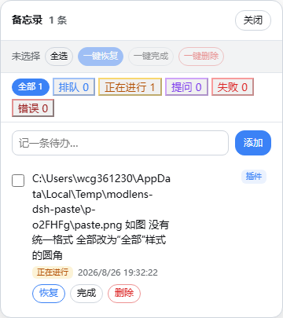

# dsh-memo-notebook

按工作区记录未完成任务：自动捕获排队/执行中的用户指令，持久化到磁盘，支持插队打断与一键按原状态恢复重发。为 **DeepSeek Harness (dsh)** 打造的备忘录/待办插件。

> 为什么需要它？在长会话里，任务排队、被打断、恢复是家常便饭。memo-notebook 把「我让助手做什么、做到哪了、被打断前是什么状态」变成一个可见、可点、可恢复的面板——再也不怕切换会话或重启 web 后丢失上下文。

---

## ✨ 功能亮点

| 功能 | 说明 |
|------|------|
| 🪝 **自动捕获** | 发给助手的新指令自动进入备忘录，排队 → 进行中 状态自动流转 |
| ⚡ **插队打断** | 新消息插入时，旧任务自动标记为「打断」，并记录原状态（`previousStatus`） |
| 🔄 **一键恢复** | 恢复按钮按**原状态**恢复：原排队 → 回排队；原进行中/提问 → 恢复 running 并继续执行 |
| ✅ **划线完成** | 「一键完成」将任务划线下沉（不删除，保留记录）；「一键删除」才真正移除 |
| 🗂 **状态分类** | 全部 / 排队 / 正在进行 / 提问 / 失败 / 打断 / 已完成（失败与错误合并） |
| 🧹 **自动完成** | agent 正常结束时任务自动标记「已完成」划线，手动完成与自动完成区分 |
| 📌 **窗口置顶** | 浮动面板固定在侧栏之上、设置窗口之下；标题栏可拖动，位置持久化保存 |
| 💾 **同步持久化** | 每次变更**立即写盘**（同步写入），停止/重启 web 不丢数据 |
| 🌏 **UTF-8 存储** | 避免 Windows 控制台编码导致的乱码问题 |

---

## 📸 截图



---

## 📦 安装

### 前置要求

- 已安装 **DeepSeek Harness (dsh)**，并有一个可用的 profile（默认 `web`）
- 机器能访问 GitHub（安装时从 GitHub 拉取源码）

### 方式一：dsh plugin add（推荐 ✅ 已验证）

打开终端，运行：

```bash
# 安装到 web profile（最常用）
dsh plugin add SeanWang114514/dsh-memo-notebook --profile web

# 或使用完整仓库地址
dsh plugin add https://github.com/SeanWang114514/dsh-memo-notebook.git --profile web

# 安装到其他 profile（如 default）
dsh plugin add SeanWang114514/dsh-memo-notebook --profile default
```

> `--profile` 也可以放在 `add` 前面：`dsh plugin --profile web add ...`，两种写法等价（均已实测）。

安装成功后，`dsh --profile web --dump-config` 应能看到 `memo-notebook` 插件行（含 `stateFile` 配置）。

### 方式二：手动链接（开发调试用）

将本仓库克隆后链接到 profile 的 node_modules：

```bash
git clone https://github.com/SeanWang114514/dsh-memo-notebook.git
mklink /J "%USERPROFILE%\.dsh\profiles\web\node_modules\memo-notebook" "%CD%\dsh-memo-notebook"
```

### 安装后

1. **重启 dsh web**：让 Host 端（`lib/index.mjs`）生效
2. **刷新浏览器**（Ctrl+F5）：加载 Client 端（`lib/client.js`）
3. 页面右下角出现 **📝 图标**，点击打开备忘录面板即安装成功

### 验证安装

```bash
# 1. 插件已注册
dsh --profile web --dump-config | grep -A2 memo-notebook

# 2. API 可访问（重启 web 后）
curl http://127.0.0.1:3080/api/memo/list
# → {"items":[...]} 表示 Host 端工作正常
```

### 卸载

```bash
dsh plugin remove memo-notebook --profile web
```

---

## 🚀 使用

1. 点击浏览器右下角的 📝 图标打开面板
2. 在输入框输入任务，回车/点击「添加」入队
3. 任务状态实时流转：排队 → 正在进行 → 已完成（自动划线）
4. 被插队打断的任务显示「打断」徽章，点「恢复」按原状态回去
5. 勾选多条目后可用「一键完成 / 一键删除 / 一键恢复」批量操作

### 面板交互

- **标题栏拖动**：按住面板顶部空白处拖动，位置自动记忆
- **分类筛选**：点击分类按钮过滤状态，分类按钮风格与删除按钮完全一致
- **勾选**：点击条目左侧圆圈，可多选后批量操作

---

## 🔌 API

| 方法 | 路径 | 说明 |
|------|------|------|
| GET | `/api/memo/list` | 列出全部条目 |
| GET | `/api/memo/events` | SSE 实时推送状态变化 |
| POST | `/api/memo/add` | 新增条目 `{text}` |
| POST | `/api/memo/complete` | 标记完成（划线保留）`{id}` |
| POST | `/api/memo/remove` | 删除条目 `{id}` |
| POST | `/api/memo/resume` | 恢复条目到原状态并继续执行 `{id}` |
| POST | `/api/memo/batch-complete` | 批量完成 `{ids}` |
| POST | `/api/memo/batch-remove` | 批量删除 `{ids}` |
| POST | `/api/memo/batch-resume` | 批量恢复 `{ids}` |

### 示例

```bash
# 新增
curl -X POST http://127.0.0.1:3080/api/memo/add \
  -H "Content-Type: application/json" \
  -d '{"text": "帮我写周报"}'

# 恢复
curl -X POST http://127.0.0.1:3080/api/memo/resume \
  -H "Content-Type: application/json" \
  -d '{"id": "mtbmk094-nhgxutw7"}'
```

---

## ⚙️ 配置

`cordis.patch.yml` 中通过 `stateFile` 指定持久化文件：

```yaml
- insert:
    - id: memo-notebook
      name: memo-notebook
      config:
        stateFile: !!js dshHomePath('memo-notebook/state.json')
```

默认存储于 `~/.dsh/memo-notebook/state.json`（UTF-8，每次操作同步写入）。

---

## 🗂 状态流转

```
用户发消息 ──► queued（排队）
                 │ agent 开始执行
                 ▼
              running（进行中）
                 │ 新消息插队 / agent 空闲
                 ▼
           interrupted（打断，记录 previousStatus）
                 │ 点「恢复」
                 ▼
      回到 previousStatus（queued 或 running）
                 │ agent 正常完成
                 ▼
           completed（已完成，划线保留）
```

| 状态 | 徽章颜色 | 说明 |
|------|---------|------|
| queued | 蓝色 | 排队等待执行 |
| running | 绿色 | 正在执行 |
| asking | 橙色 | 向用户提问中 |
| failed | 红色 | 执行失败（含错误） |
| interrupted | 紫色 | 被新消息打断（记录原状态） |
| completed | 灰色 | 已完成（划线） |

---

## 📁 目录结构

```
memo-notebook/
├── lib/
│   ├── index.mjs   # Host: API + 事件捕获 + 状态流转 + 持久化
│   └── client.js   # Client: 侧栏按钮 + 浮动面板 UI
├── cordis.patch.yml   # dsh 插件挂载配置
├── package.json       # 插件元数据（dsh.bundle manifest）
├── screenshots.json   # 市场截图声明
├── shot-panel.png     # 面板截图
└── README.md
```

---

## 🧩 技术细节

- **Host**：监听 `agent/inbox/inserted`（新指令入队）、`agent/status`（状态流转）、`tools/result`（工具执行结果）事件，驱动状态机
- **Client**：原生 DOM + addEventListener，无框架依赖；骨架只构建一次，列表独立渲染，输入框永不被重建（焦点稳定）
- **持久化**：同步 `writeFileSync`，每次变更立即落盘，杜绝进程被杀时数据丢失
- **SSE 推送**：`/api/memo/events` 实时推送状态变化，多标签页同步

---

## 📝 许可证

MIT License — 自由使用、修改、分发。
